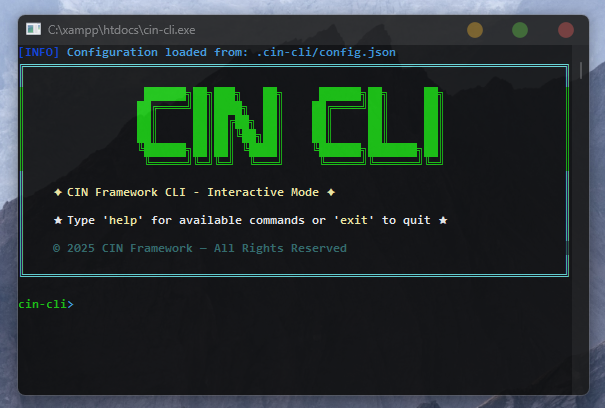

# **CIN-CLI**

<div align="center">
  
</div>

<div align="center">
  
[](https://www.cin-framework.com)
[](LICENSE)
[](SECURITY.md)
[](COMMANDS.md)
  
</div>

**CIN-CLI** is a comprehensive command-line tool specifically designed to manage the **CIN Framework** with ease and speed.

### @ Core Capabilities

**CIN-CLI** provides a flexible command-line interface that empowers developers with:

```
╭─────────────────────────────────────────────────────────╮
  ▶ Download the framework                               
  ▶ Install and update it seamlessly                     
  ▶ Manage it completely from any development            
    environment or server                                
╰─────────────────────────────────────────────────────────╯
```

### @ Advanced Features

```
╭─────────────────────────────────────────────────────────╮
  ◆ Download and manage official CIN libraries           
  ◆ Fix the system when any issues occur                 
  ◆ Configure new applications from scratch              
╰─────────────────────────────────────────────────────────╯
```

### @ Architecture Excellence

**CIN-CLI** is fully responsible for all commands in the **CIN** system, engineered to deliver:

```
╔═══════════════════════════════════════════════════════════╗
  ✦ Lightweight           → Minimal resource footprint     
  ✦ Fast response         → Optimized performance          
  ✦ Scalable              → Complex project ready          
  ✦ Native integration    → CIN architecture support       
╚═══════════════════════════════════════════════════════════╝
```

• **Automated Testing**: Generate and run comprehensive test suites for your applications
• **Performance Optimization**: Built-in tools for code analysis and performance enhancement
• **Documentation Generation**: Automatically create detailed documentation for your projects
• **Security Scanning**: Integrated security checks and vulnerability assessments
• **Deployment Automation**: Streamlined deployment processes for various hosting environments

## How to Use

### 1. Download the Program
### 1.1. Supported systems
CIN-CLI is supported on the following operating systems:

<div align="center">

| <br>**Windows**<br>(64-bit) | <br>**macOS**<br>(Intel 64-bit)<br>(Apple Silicon - M1/M2/M3/etc. - ARM64) | <br>**Linux**<br>(64-bit) |
|:---:|:---:|:---:|

</div>

First, you must choose the appropriate version. Here are the available versions:
[Releases](https://github.com/cin-framework/cin-cli/releases)

### 2. Installation
Then place your version in a main website folder, i.e., in the location where you want to build your web application, such as placing it in `C:\xampp\htdocs` or any location you prefer.

**Important Note:** You must know that the location where you place `cin-cli` is the same location where the framework and **CIN** libraries will be downloaded.

### 3. Running the Program
After that, you can run the program using the following commands:

**On Linux/macOS systems:**
```bash
./cin-cli
```

**Or without the dot if you encounter a problem:**
```bash
cin-cli
```

**On Windows system:**

<div align="center">
  
</div>

You can try running the `.exe` file directly without commands, and the command window dedicated to **CIN-CLI** will open.

### 4. Using Commands
After opening the **CIN-CLI** command window, you can enter the `help` command and all the commands that can be used will appear:

```bash
help
```
[Commands More](COMMANDS.md)

### 5. Learn More
You can learn more about **CIN Framework** through the official website:
[www.cin-framework.com](https://www.cin-framework.com)

## License

This CLI tool is proprietary software.  
All rights are reserved by **CIN CLI**.  
You may **modify** the source code for personal or internal use.  
You may **NOT** redistribute, sublicense, or sell this CLI tool in any form.

For support or inquiries, contact us at: **support@cin-framework.com**

> © CIN FRAMEWORK — All Rights Reserved.